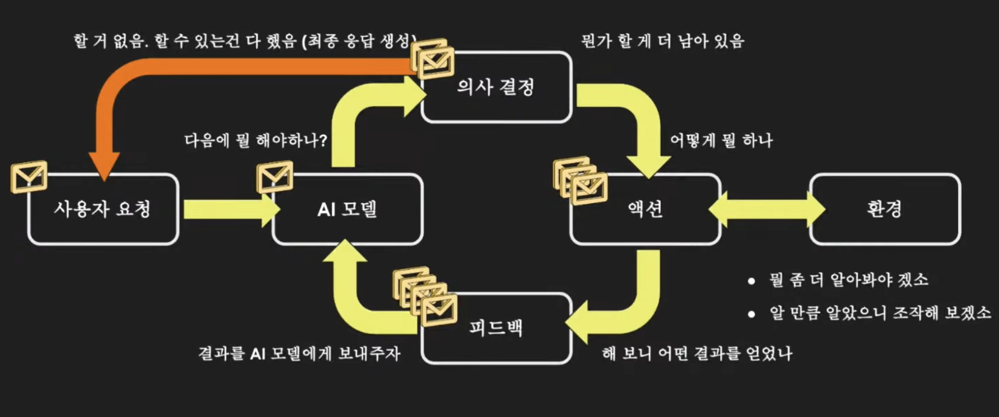
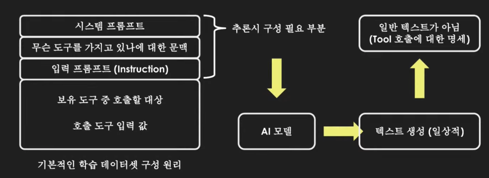
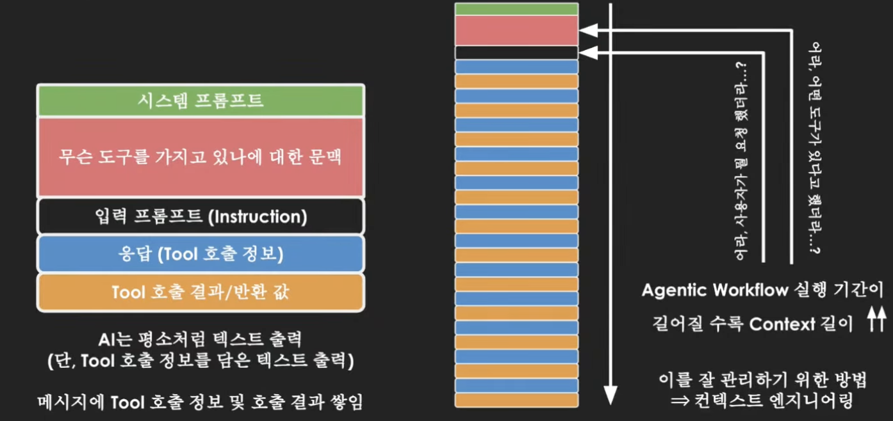

# Agent AI 101
- start date: 1/12 
- source: AI Factory 강연 Agent AI 101 (강연자: 박찬성)
## 1. AI Agent란
- 나 대신 일처리 / 일처리 방식 < 아웃풋 을 중요시 / 일처리 방식에 따른 비용차이o
- 일처리: 상황파악(문맥파악) + 의사결정 + 액션
    - 상황파악: 실제 세상으로부터 정보(텍스트,이미지 등)획득
    - 의사결정: AI모델 고유능력
    - 액션: 실제 세상 조작(파일시스템, os, 브라우저 등)
---
- 작동방식 -> 컨텍스트 엔지니어링의 필요

- tool calling을 내재하도록 학습(데이터 pairing)

- tool의 문맥(signature, docstring으로 표현)이 늘어날수록 모델의 confusing point가 늘어남

---
- 평가방식(what?)
    - ent-to-end 평가(요청->응답)
    - agent 단위 평가(각 에이전트별 임무수행 여부)
        - agent 도구 단위 평가(적절한 tool이 적당한 타이밍에 호출? 호출결과를 보고 agent의 llm이 적절한 의사결정?)
- 평가방식(how?)
    - Hard Eval: Ground Truth 기반 정량 평가
        - Ground Truth 정의가 쉽지 않음(도메인에 따라 상이)
            - 정의만 한다면 입력을 synthesizing->N개의 테스트케이스로 확장가능.
        - end-to-end보다 agent tool단위 평가라면 {자연어입력-자연어출력}의 평가상 어려움을 커버 가능
    - Soft Eval: LLM as Judge(정성평가)
        - LLM모델마다 task유형에 따라 엄격함-관대함 정도가 다를 가능성o
        - 프롬프트 엔지니어링 의존성o
## 2. 밑바닥부터 AI agent 구현 (필요성)
## 3. AI agent 특화 프레임워크 사용의 장점
## 4. 결론